# Module 8 Implement API Management

## Lab: Creating a multi-tier solution by using services in Azure

1. **Nombres y apellidos:** Francisco Javier Moreno Quevedo
2. **Fecha:** 17/01/2021
3. **Resumen del Ejercicio:** Crear una Web App y un API como proxy para otros servicios con un header personalizado
4. **Dificultad o problemas presentados y como se resolvieron:** Ninguna


### Exercise 1: Creating an Azure App Service resource by using a Docker container image

Crear una **Web App**

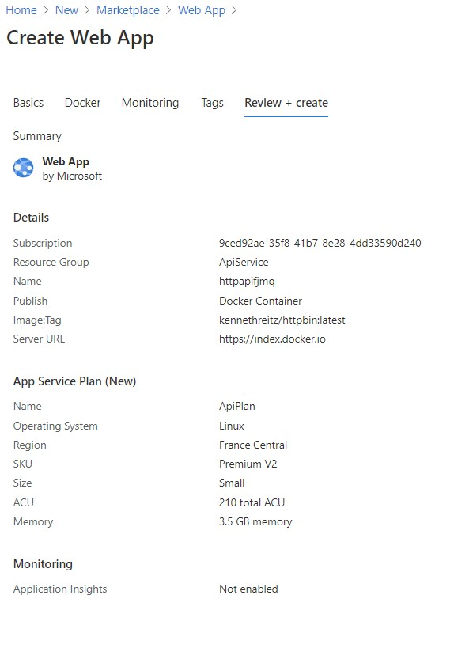

Probar desde el Swagger


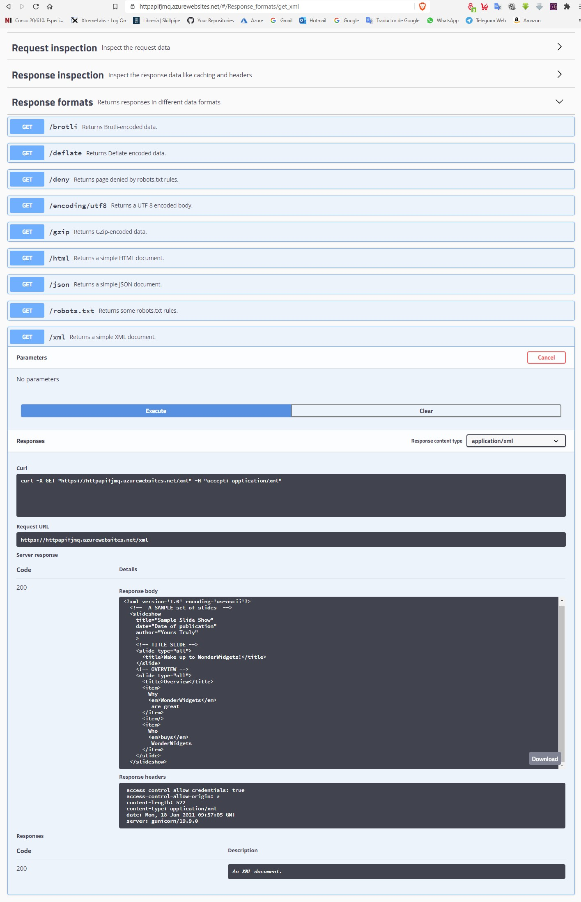

### Exercise 2: Build an API proxy tier by using Azure API Management

Crear un **API Management**

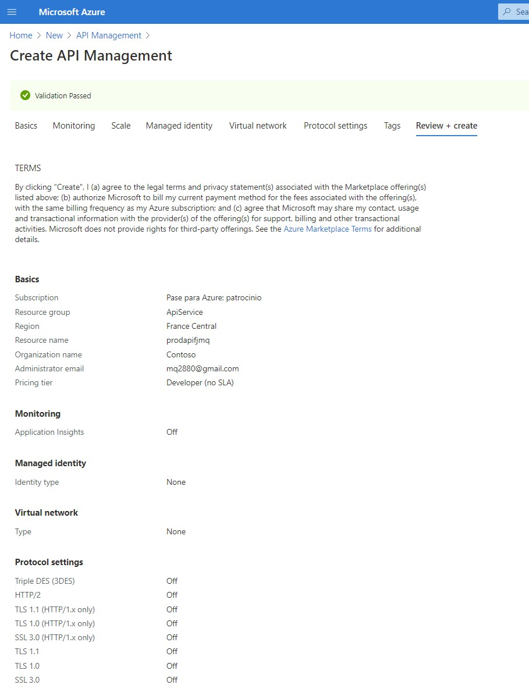

Crear una nueva API

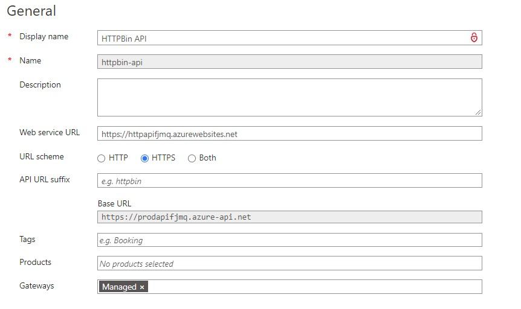


Añadir una nueva **Operation**

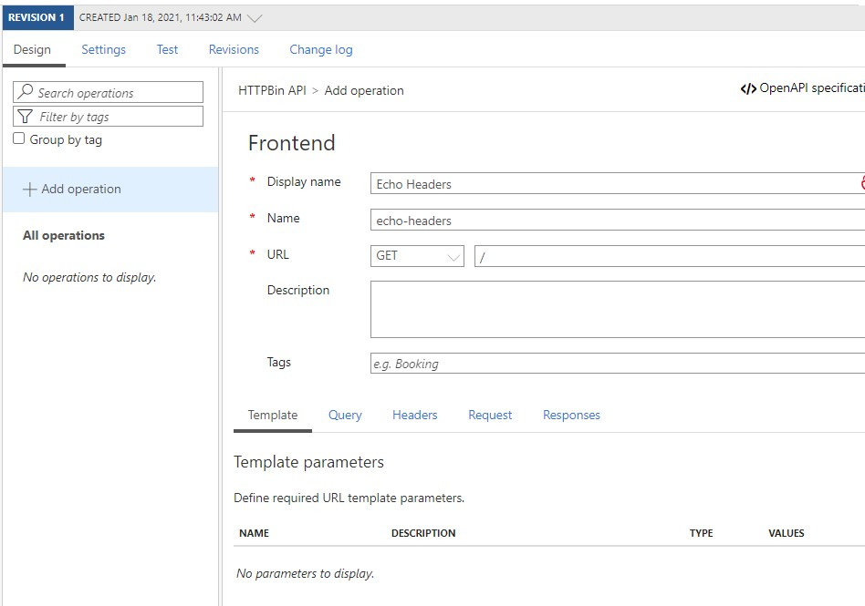


Añadir un nuevo Header

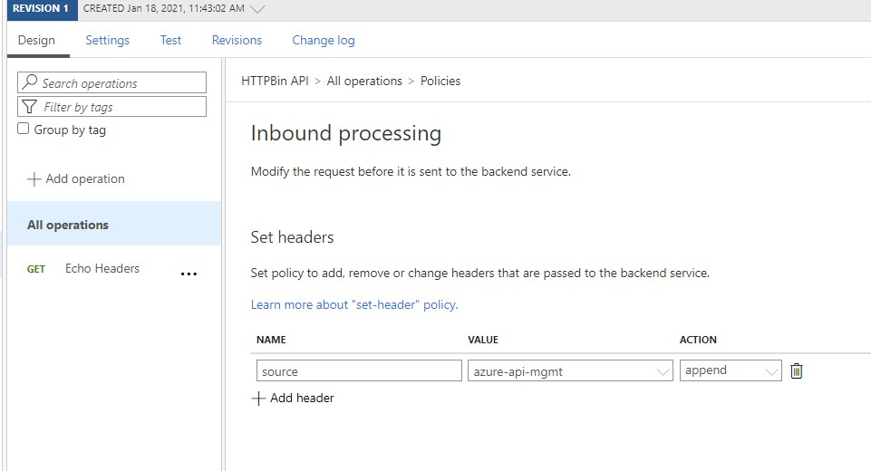


Actualizar el Backend

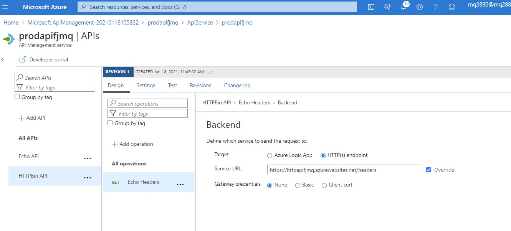

Probar

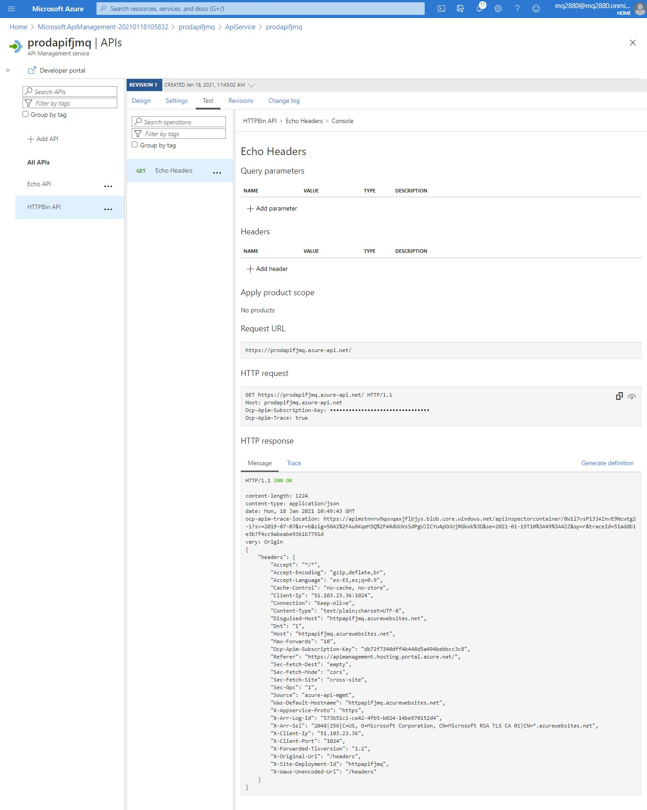

Añadir una nueva **operation** 

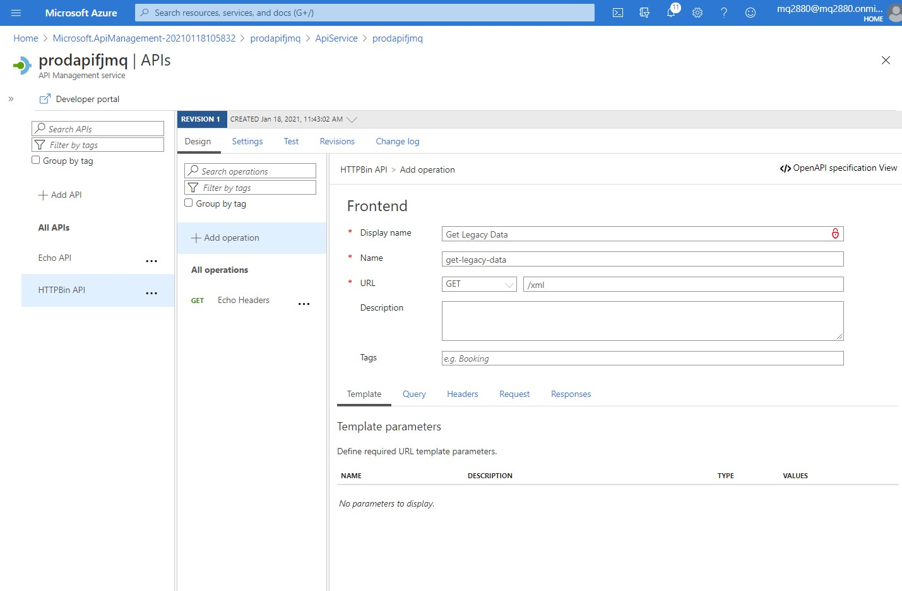


Probar

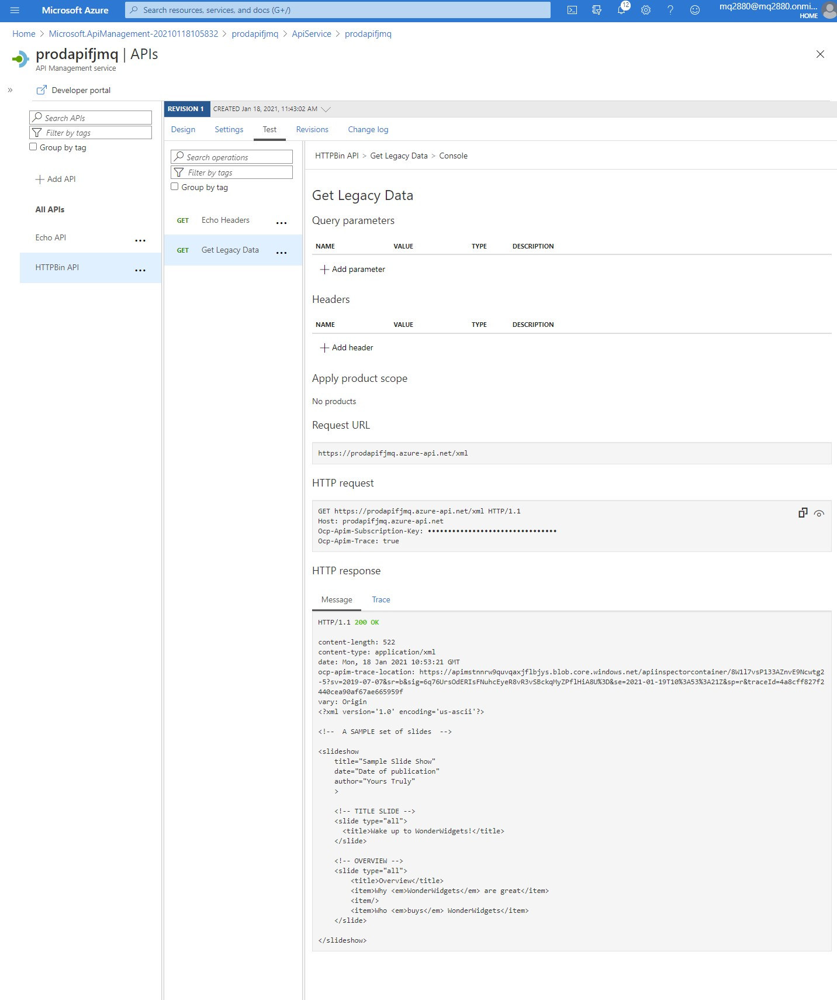


Añadir un OutBoun Personalizado 

```
<outbound>
    <base />
    <xml-to-json kind="direct" apply="always" consider-accept-header="false" />
</outbound>
```

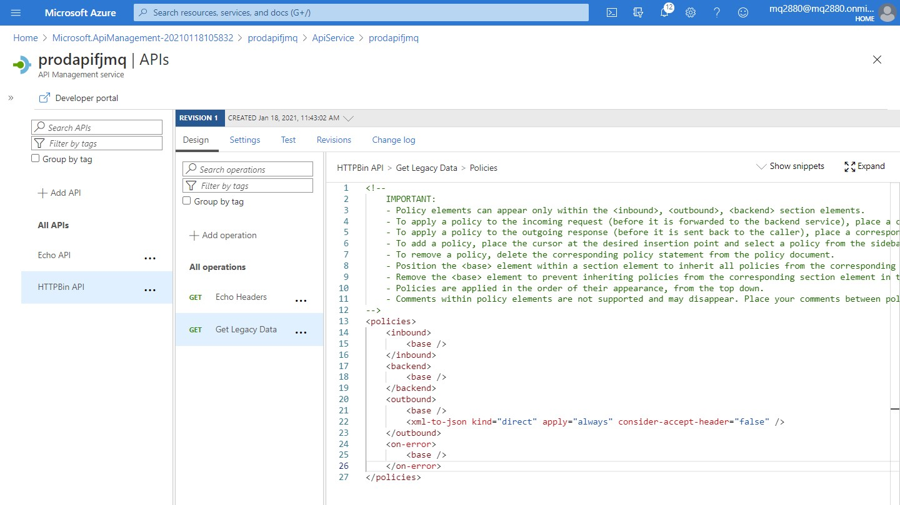

Comprobar que el nuevo resultado es un Json

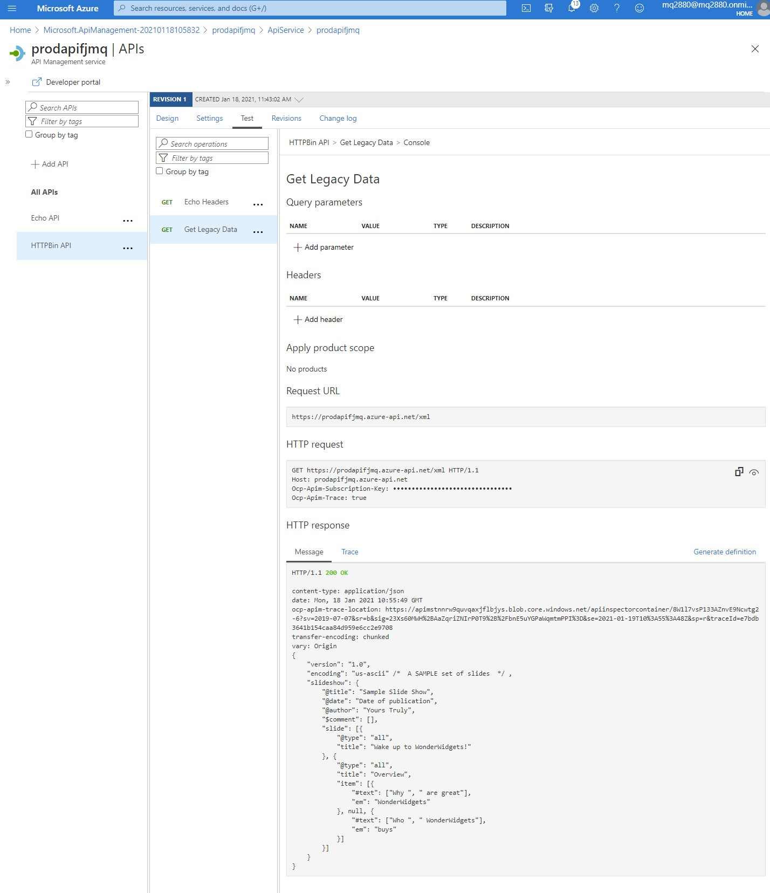

Usar  **Trace** para ver la peticion enviada al servicio de BackEnd

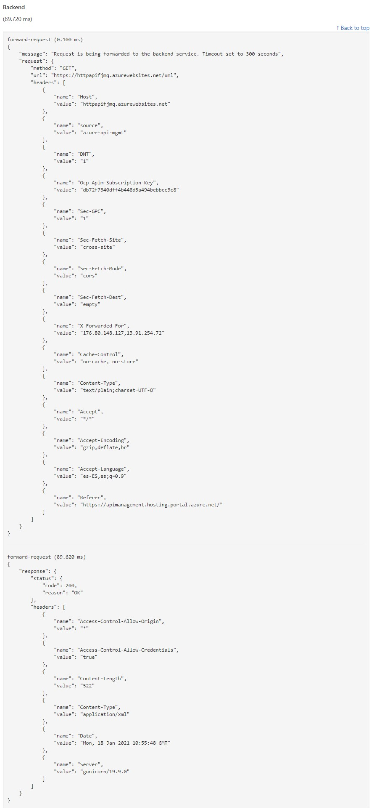

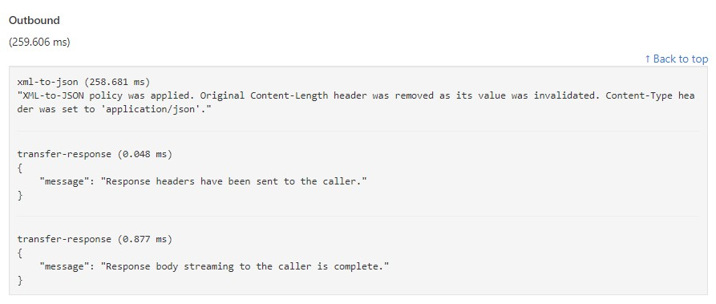